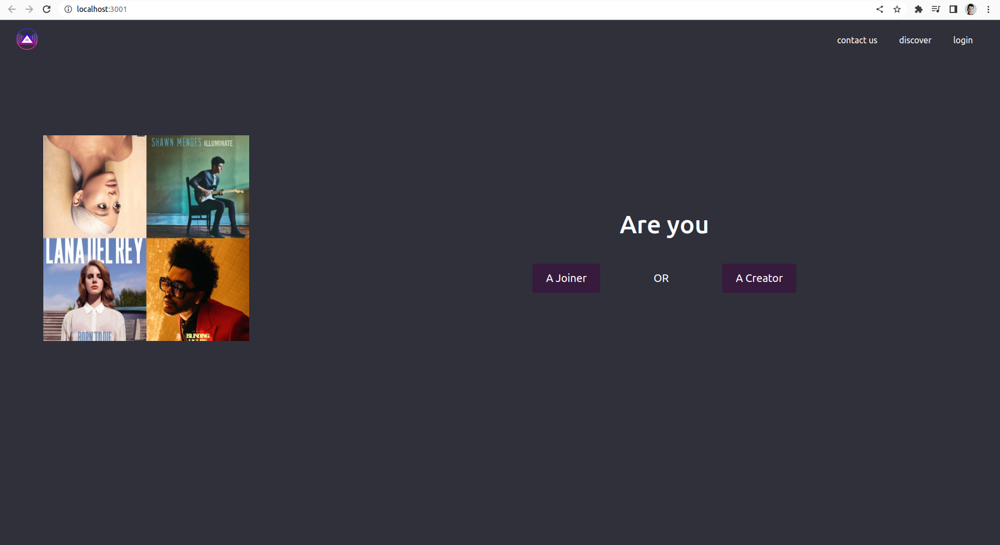
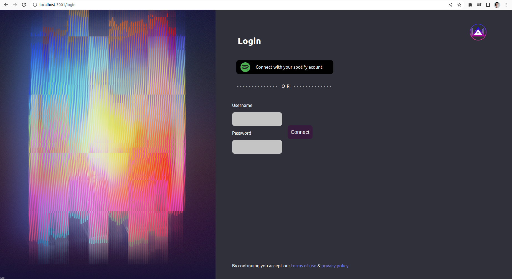

# SpotifyRooms

---

Creation of a complete application to allow users to create their own Spotify channels or join a channel using the Spotify API and development of a voting system to choose the songs or the list of reading to play.

---

Here you enter the room either as a **Joiner** or a **Creator**



---

Choose either connect directly with **SpotifyAPI** Login or use our **loginSystem**




---

**Get the Application worked :**

```bash
# run server :
cd server && composer install && php artisan serve
# run client :
cd client && npm install && npm start
```
